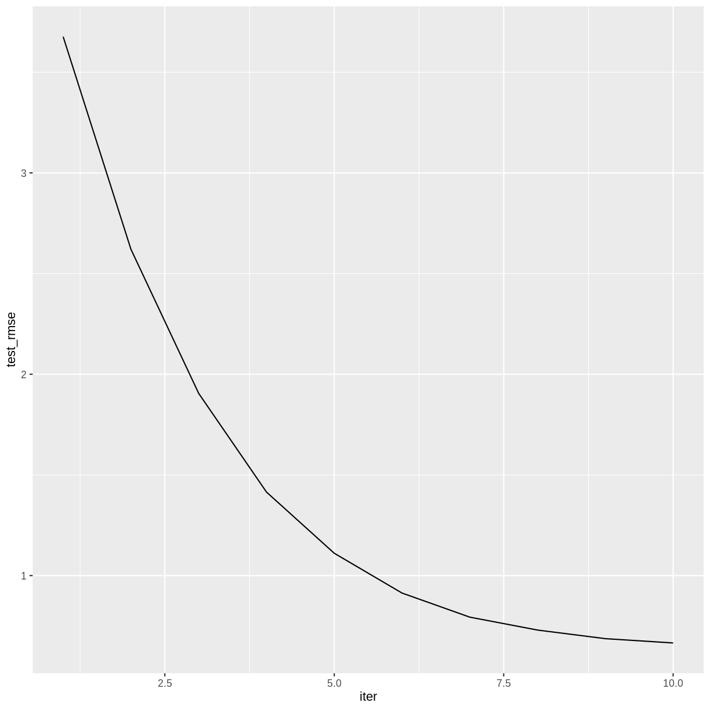
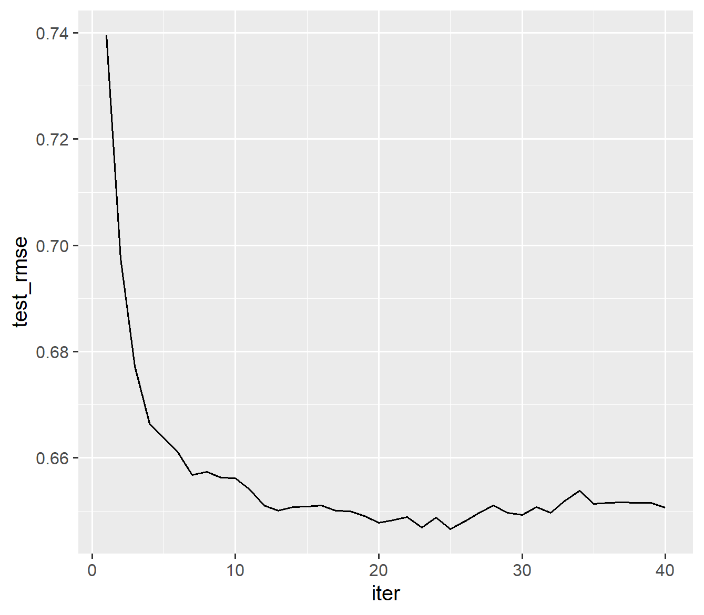
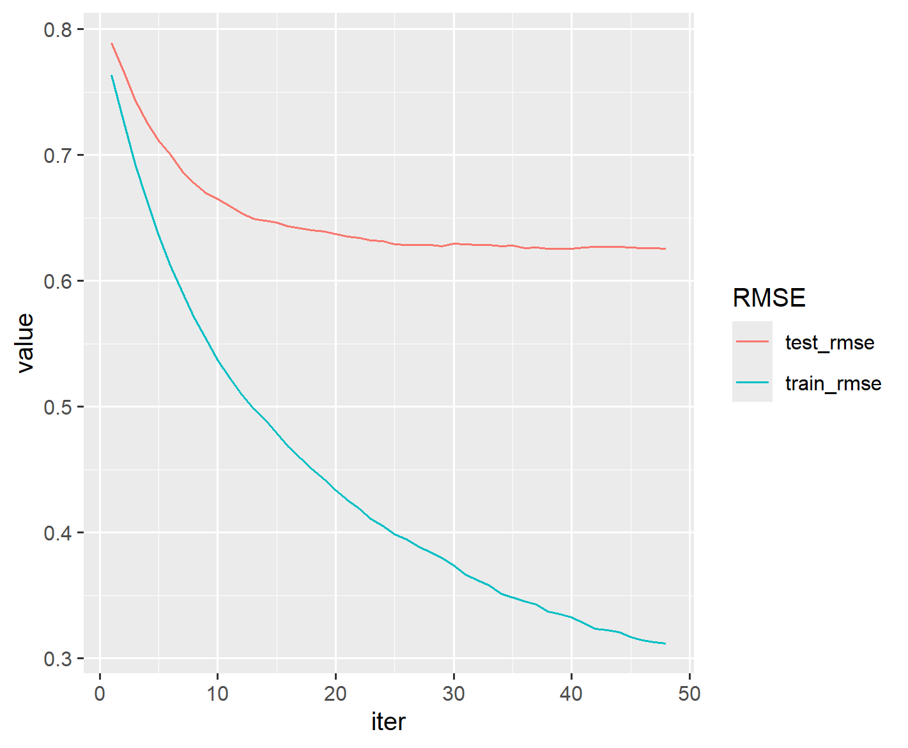

:::::::::::::::::::::::::::::::::::::: questions

- What is gradient boosting?
- How can we train an XGBoost model?
- What is the learning rate?

::::::::::::::::::::::::::::::::::::::::::::::::

::::::::::::::::::::::::::::::::::::: objectives

- Introduce XGBoost models.
- Train regression models using XGBoost
- Explore the effect of learning rate on the training process.

::::::::::::::::::::::::::::::::::::::::::::::::

## Gradient Boosted Trees

A random forest is called an *ensemble* method, because it combines the results of a set of trees to form a single prediction. *Gradient boosted trees* are also ensemble methods, but instead of forming a forest of trees from different random samples, they grow successive trees that systematically reduce the error of the model at each iteration.

We will be using the R package `xgboost`, which gives a fast, scalable implementation of a gradient boosting framework. For more information on how `xgboost` works, see the [XGBoost Presentation](https://cran.r-project.org/web/packages/xgboost/vignettes/xgboost_introduction.html) vignette and the [Introduction to Boosted Trees](https://xgboost.readthedocs.io/en/stable/tutorials/model.html) tutorial in the XGBoost documentation. In this episode we will use XGBoost to create a regression model, but this framework can also be used for classification problems.

## Reload the Red Wine Data

```r
library(tidyverse)
library(here)
```

```r
library(xgboost)
```

Notice that both `xgboost` and `dplyr` have a function called `slice`. In the following code block, we specify that we want to use the `dplyr` version.

```r
wine <- read_csv(here("data", "wine.csv"))
redwine <- wine |> dplyr::slice(1:1599) 
trainSize <- round(0.80 * nrow(redwine))
set.seed(1234) 
trainIndex <- sample(nrow(redwine), trainSize)
trainDF <- redwine |> dplyr::slice(trainIndex)
testDF <- redwine |> dplyr::slice(-trainIndex)
```

The `xgboost` package defines a data structure called `xgb.DMatrix` that optimizes storage and retrieval. To use the advanced features of `xgboost`, it is necessary to convert our training and test sets to the `xgb.DMatrix` class.

```r
dtrain <- xgb.DMatrix(data = as.matrix(select(trainDF, -quality)), label = trainDF$quality)
dtest <- xgb.DMatrix(data = as.matrix(select(testDF, -quality)), label = testDF$quality)
```

## Training an XGBoost Model

Since we specified a `label` in our `dtrain` and `dtest` matrices, there is no need to specify a formula when training a model using `xgb.train`. The label that we specified (quality rating) will be the response variable, and the columns of the `data` that we specified will be the explanatory variables. One option that we must specify is `nrounds`, which restricts the number of boosting iterations the algorithm will make.

```r
redwineXGB <- xgb.train(data = dtrain, nrounds = 10)
```

Let's calculate the RMSE on our testing set. The `predict` function for XGBoost models expects a matrix, so we pass it the `xgb.DMatrix` that we created from our testing set.

```r
pQuality <- predict(redwineXGB, dtest)
errors <- pQuality - testDF$quality
sqrt(mean(errors^2)) #RMSE
```

```output
[1] 0.6561705
```

## More Details on the Training Process

The `xgb.train` command will automatically calculate the RMSE on our testing set after each iteration if we set the testing set in the `evals`.

```r
redwineXGB <- xgb.train(data = dtrain, evals = list(test = dtest), nrounds = 10)
```

```output
[1]	test-rmse:0.739547 
[2]	test-rmse:0.697529 
[3]	test-rmse:0.677260 
[4]	test-rmse:0.666461 
[5]	test-rmse:0.663789 
[6]	test-rmse:0.661025 
[7]	test-rmse:0.656802 
[8]	test-rmse:0.657357 
[9]	test-rmse:0.656321 
[10]	test-rmse:0.656171 
```

The training history is saved as a data frame in the attribute `evaluation_log`, so we can plot how the RMSE changes during the training process.

```r
attr(redwineXGB, "evaluation_log") |>
  ggplot(aes(x = iter, y = test_rmse)) +
  geom_line()
```
{alt="line plot of test rmse by iteration"}

::::::::::::::::::::::::::::::::::::: challenge

## Challenge: How many boosting iterations?

Experiment with different values of `nrounds` in the above call to `xgb.train`.
Does the accuracy of the model improve with more iterations? Is there a point
after which the model ceases to improve?

:::::::::::::::::::::::: solution
The accuracy of the model doesn't appear to improve after iteration 25.

```r
redwineXGB <- xgb.train(data = dtrain, 
                        evals = list(test = dtest), 
                        nrounds = 40)
```

```output
[1]	test-rmse:0.739547 
[2]	test-rmse:0.697529 
[3]	test-rmse:0.677260 
[4]	test-rmse:0.666461 
[5]	test-rmse:0.663789 
[6]	test-rmse:0.661025 
[7]	test-rmse:0.656802 
[8]	test-rmse:0.657357 
[9]	test-rmse:0.656321 
[10]	test-rmse:0.656171 
[11]	test-rmse:0.654021 
[12]	test-rmse:0.651006 
[13]	test-rmse:0.650065 
[14]	test-rmse:0.650734 
[15]	test-rmse:0.650865 
[16]	test-rmse:0.651042 
[17]	test-rmse:0.650033 
[18]	test-rmse:0.649995 
[19]	test-rmse:0.649126 
[20]	test-rmse:0.647756 
[21]	test-rmse:0.648309 
[22]	test-rmse:0.648837 
[23]	test-rmse:0.646943 
[24]	test-rmse:0.648741 
[25]	test-rmse:0.646583 
[26]	test-rmse:0.648100 
[27]	test-rmse:0.649653 
[28]	test-rmse:0.651069 
[29]	test-rmse:0.649710 
[30]	test-rmse:0.649308 
[31]	test-rmse:0.650731 
[32]	test-rmse:0.649718 
[33]	test-rmse:0.651962 
[34]	test-rmse:0.653782 
[35]	test-rmse:0.651400 
[36]	test-rmse:0.651547 
[37]	test-rmse:0.651667 
[38]	test-rmse:0.651585 
[39]	test-rmse:0.651566 
[40]	test-rmse:0.650699 
```

```r
attr(redwineXGB, "evaluation_log") |>
  ggplot(aes(x = iter, y = test_rmse)) +
  geom_line()
```

{alt="line plot of test rmse by iteration"}

:::::::::::::::::::::::::::::::::

::::::::::::::::::::::::::::::::::::::::::::::::

## Learning Rate

Machine learning algorithms that reduce a loss function over a sequence of iterations typically have a setting that controls the *learning rate*. A smaller learning rate will generally reduce the error by a smaller amount at each iteration, and therefore will require more iterations to arrive at a given level of accuracy. The advantage to a smaller learning rate is that the algorithm is less likely to overshoot the optimum fit; the disadvantage is the algorithm may not reach the optimum fit. 

In XGBoost, the setting that controls the learning rate is called `eta`, which is one of several *hyperparameters* that can be adjusted. Its default value is 0.3, but smaller values will usually perform better. It must take a value in the range 0 < `eta` < 1.

The following code will set `eta` to its default value. We include a value for `early_stopping_rounds`, which will halt the training after a specified number of iterations pass without improvement. When using `early_stopping_rounds`, `nrounds` can be set to a very large number. To avoid printing too many lines of output, we also set a value for `print_every_n`.

```r
redwineXGB <- xgb.train(data = dtrain, 
                        params = list(eta = 0.3),
                        evals = list(test = dtest), 
                        nrounds = 1000,
                        early_stopping_rounds = 10,
                        print_every_n = 5)
```

```output
Will train until test_rmse hasn't improved in 10 rounds.

[1]	test-rmse:0.739547 
[6]	test-rmse:0.661025 
[11]	test-rmse:0.654021 
[16]	test-rmse:0.651042 
[21]	test-rmse:0.648309 
[26]	test-rmse:0.648100 
[31]	test-rmse:0.650731 
Stopping. Best iteration:
[35]	test-rmse:0.651400

[35]	test-rmse:0.651400 
```

The 35th iteration had the smallest RMSE.

::::::::::::::::::::::::::::::::::::: challenge

## Challenge: Experiment with the learning rate.

Experiment with different values of `eta` in the above call to `xgb.train`.
Notice how smaller values of eta require more iterations. Can you find a
value of `eta` that results in a lower testing set RMSE than the default?

:::::::::::::::::::::::: solution

A learning rate around 0.1 reduces the RMSE somewhat.

```r
redwineXGB <- xgb.train(data = dtrain, 
                        params = list(eta = 0.1),
                        evals = list(test = dtest), 
                        nrounds = 1000,
                        early_stopping_rounds = 10,
                        print_every_n = 15)
```

```output
Will train until test_rmse hasn't improved in 10 rounds.

[1]	test-rmse:0.789059 
[16]	test-rmse:0.643070 
[31]	test-rmse:0.629120 
[46]	test-rmse:0.625930 
Stopping. Best iteration:
[48]	test-rmse:0.625455

[48]	test-rmse:0.625455 
```
:::::::::::::::::::::::::::::::::

::::::::::::::::::::::::::::::::::::::::::::::::

## Variable Importance

As with random forests, you can view the predictive importance of each explanatory variable.

```r
xgb.importance(model = redwineXGB)
```

```output
                 Feature       Gain      Cover  Frequency
                  <char>      <num>      <num>      <num>
 1:              alcohol 0.30854145 0.20533266 0.08665431
 2:     volatile.acidity 0.14497002 0.12210243 0.10889713
 3:            sulphates 0.12760406 0.13532236 0.08711770
 4: total.sulfur.dioxide 0.08528885 0.10227935 0.09360519
 5:        fixed.acidity 0.06277324 0.06687905 0.14365153
 6:            chlorides 0.05994638 0.08001722 0.09592215
 7:              density 0.04635801 0.06776201 0.07599629
 8:       residual.sugar 0.04470028 0.06218626 0.09267841
 9:          citric.acid 0.04053801 0.06268225 0.08109361
10:                   pH 0.04017616 0.05639794 0.06672845
11:  free.sulfur.dioxide 0.03910355 0.03903844 0.06765524
```

The rows are sorted by `Gain`, which measures the accuracy improvement contributed by a feature based on all the splits it determines. Note that the sum of all the gains is 1.


## Training Error vs. Testing Error

Like many machine learning algorithms, gradient boosting operates by minimizing the error on the training set. However, we evaluate its performance by computing the error on the testing set. These two errors are usually different, and it is not uncommon to have much lower training RMSE than testing RMSE.

To see both training and testing errors, we can add a `train` item to the `evals`.

```r
redwineXGB <- xgb.train(data = dtrain, 
                        params = list(eta = 0.1),
                        evals = list(train = dtrain, test = dtest), 
                        nrounds = 1000,
                        early_stopping_rounds = 10,
                        print_every_n = 15)
```
```output
Multiple eval metrics are present. Will use test_rmse for early stopping.
Will train until test_rmse hasn't improved in 10 rounds.

[1]	train-rmse:0.763413	test-rmse:0.789059 
[16]	train-rmse:0.467861	test-rmse:0.643070 
[31]	train-rmse:0.366838	test-rmse:0.629120 
[46]	train-rmse:0.314553	test-rmse:0.625930 
Stopping. Best iteration:
[48]	train-rmse:0.311647	test-rmse:0.625455

[48]	train-rmse:0.311647	test-rmse:0.625455 
```

```r
attr(redwineXGB, "evaluation_log") |>  
  pivot_longer(cols = c(train_rmse, test_rmse), names_to = "RMSE") |> 
  ggplot(aes(x = iter, y = value, color = RMSE)) + 
  geom_line()
```

{alt="line plot of test rmse by iteration"}

Notice that beyond iteration 20 or so, the training RMSE continues to decrease while the testing RMSE has basically stabilized. This divergence indicates that the later training iterations are improving the model based on the particularities of the training set, but in a way that does not generalize to the testing set.

## Saving a trained model

As models become more complicated, the time it takes to train them becomes nontrivial. For this reason, it can be helpful to save a trained XGBoost model. We'll create a directory in our project called `saved_models` and save our XGBoost model in a universal binary format that can be read by any XGBoost interface (e.g., R, Python, Julia, Scala).

```r
dir.create(here("saved_models"))
xgb.save(redwineXGB, here("saved_models", "redwine.model"))
```

This trained model can be loaded into a future R session with the `xgb.load` command.

```r
reloaded_model <- xgb.load(here("saved_models", "redwine.model"))
```

However, while `reloaded_model` can be used with the `predict` function, it is not identical to the `redwineXGB` object. For reproducibility, it is important to save the source code used in the training process.

::::::::::::::::::::::::::::::::::::: challenge

## Challenge: White Wine

Build an XGBoost model for the white wine data (rows 1600-6497) of the
`wine` data frame. Compare the RMSE and variable importance with
the random forest white wine model from the previous episode.

:::::::::::::::::::::::: solution

```r
whitewine <- wine |> dplyr::slice(1600:6497) 
trainSize <- round(0.80 * nrow(whitewine))
set.seed(1234) 
trainIndex <- sample(nrow(whitewine), trainSize)
trainDF <- whitewine |> dplyr::slice(trainIndex)
testDF <- whitewine |> dplyr::slice(-trainIndex)
dtrain <- xgb.DMatrix(data = as.matrix(select(trainDF, -quality)), 
                      label = trainDF$quality)
dtest <- xgb.DMatrix(data = as.matrix(select(testDF, -quality)), 
                     label = testDF$quality)
whitewineXGB <- xgb.train(data = dtrain, 
                          params = list(eta = 0.1),
                          evals = list(train = dtrain, test = dtest), 
                          nrounds = 1000,
                          early_stopping_rounds = 10,
                          print_every_n = 20)
xgb.importance(model = whitewineXGB)
attr(whitewineXGB, "evaluation_log") |> 
  pivot_longer(cols = c(train_rmse, test_rmse), names_to = "RMSE") |> 
  ggplot(aes(x = iter, y = value, color = RMSE)) + 
  geom_line()
```

The testing set RMSE (0.656833) is worse than what we obtained in the
random forest model (0.63). The important explanatory variables are similar.

:::::::::::::::::::::::::::::::::

::::::::::::::::::::::::::::::::::::::::::::::::

So far, our XGBoost models have performed slightly worse than the equivalent random forest models. In the next episode we will explore ways to improve these results.

::::::::::::::::::::::::::::::::::::: keypoints

- Gradient boosted trees can be used for the same types of problems that random forests can solve.
- The learning rate can affect the performance of a machine learning algorithm.

::::::::::::::::::::::::::::::::::::::::::::::::

